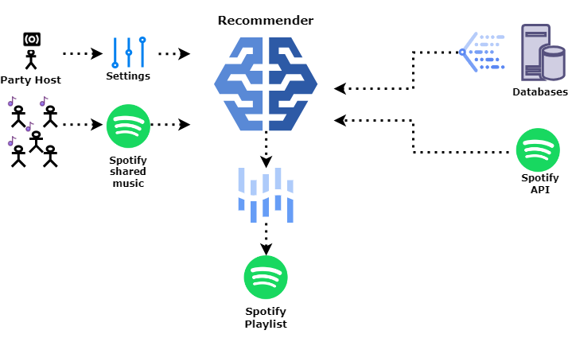
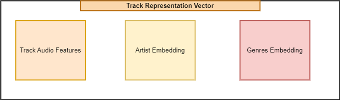
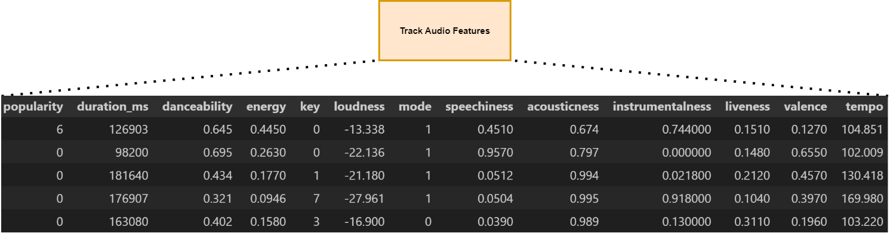
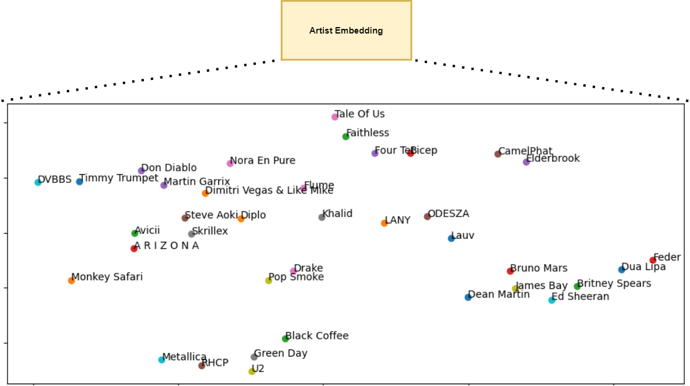
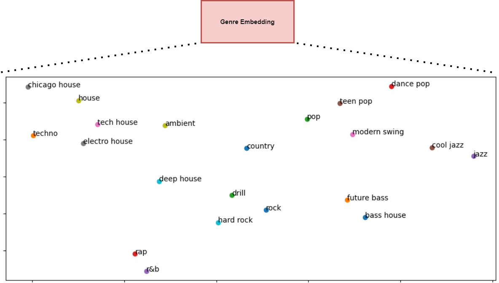
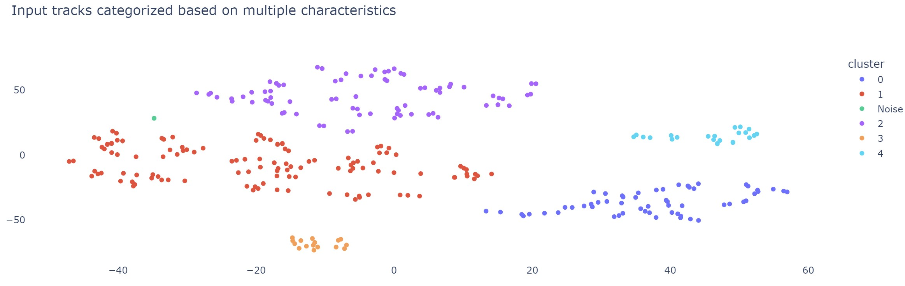
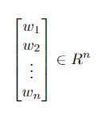

# Music Recommender

⭕ 👤 → 🎶 Music recommendation for individuals has long been ongoing on major platforms such as Spotify and Youtube. 

✅ 👥 → 🎶 The issue at hand is how to deal with recommending music based on a dynamic environment of people entering or leaving a group.

## The Idea
A few months ago I was at a 🎊 party when I realized, how tedious it would be to choose what music to play in order to be fine-tuned for the 👯attendees. Should I go to each one, ask them, write down their preference, and then search for a playlist?

That got me working on a music recommendation algorithm for large groups of people, using Spotify as a music provider.

People attending a party or gathering are able to share music with the host, who can set specific preferences based on the music gathered. The algorithm using unsupervised ML techniques can identify distinct music tastes present in the group and provide relevant tracks to satisfy and get all attendees to enjoy their time.

This algorithm is developed and tested with a subspace of Spotify music track library of ~130.000 tracks as a recommendation pool but can identify whatever music is shared through live calls on Spotify's API.

## Track Representation Vector
The foundation of the algorithm is the track representation vector.

## Audio features

## Artist Embeddings
Artist embeddings have been created by web scraping Wikipedia. Who other artists have they collaborated with, who they had a concert with, and others that are a simple reference in the same page.

In order to plot them in the 2D space, the TSNE dimensionality reduction algorithm is used.

## Genre Embeddings
Created Genre embeddings using sentence transformers with BERT LLM.

## Identifying Group Music taste profile

The profile can be identified by one or more vectors that will be later used for recommendations.

In order to do that, all the track representation vector dimensions are reduced with **TSNE**, and then all different music tastes are identified with the **DBSCAN clustering algorithm**.

**Process:**
1. M clusters from DBSCAN
2. Find the weighted centroid of the cluster based on each users track weight. (This is relevant to how many tracks each user submitted)

## Recommendation algorithm

1. The party/bar/club owner can set party settings to finetune results to specific preferences, e.g highly danceable or include only techno and deep house tracks.
2. For each M profile there are K possible matches which will all be filtered based on settings, and the neighbors with the highest scores will be kept.

## Curator

Because different versions of the same tracks exist with the same vectors, a curator has been created that operate as a DJ, that will keep the most relevant version of same tracks, and sort the tracks recommended based on energy and track bpm.

## System
A system has been created with FastAPI that you can just execute and have the backend ready for your application.

There are all the necessary endpoints ready for consumption.
