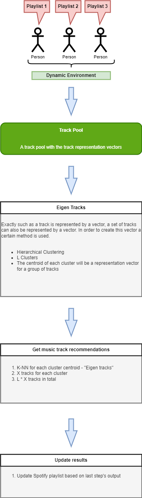

# Music Recommender
A highly adaptable music recommendation engine. Provide music recommendations based on a dynamic input environment.

## Data

### Tracks
Track audio features 
*(provided by the SpotifyAPI)*

### Genres
Embeddings
1. Create word embeddings based on same track tagged genres (provided by SpotifyAPI)
2. TF-IDF for weights on multiple genre vector representation

### Artists
Embeddings
1. Create word embeddings based on artists that have collaborated or toured together
2. TF-IDF for weights on multiple artist vector representation

## Track Representation Vector

## System
A FastAPI service along with a Dash application, consist of this music recommendation engine.

### Application

A Python Dash application to monitor the system, and construct the input environment.

### Recommender Engine

A Fast API service that provides all the recommendation data. It holds a per user session, which remembers the constructed environment and in combination with the endpoint data it was provided, it can generate music recommendations.

## How to run it?

#### Data preparation
1. Create a MongoDB Cluster
2. Provide the relevant connection string
3. Run the data loaders. They will fill MongoDB with all data.
4. Run pre processing for the data

#### Service execution
1. Execute FastAPI + Dash services **OR** deploy in docker
